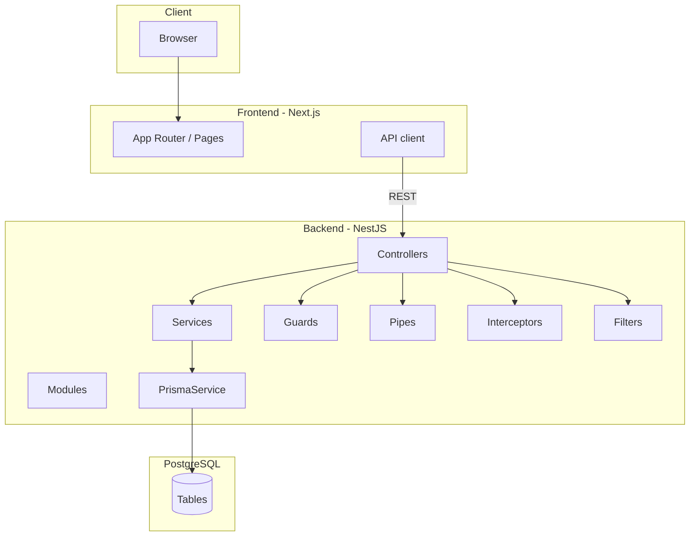

# EN1090 — Architecture

Versione: 1.0  
Data: 2026-04-01  

## Panoramica

Il sistema è composto da:

- **Frontend**: Next.js (`safe-frontend/`)
- **Backend**: NestJS (`backend/`)
- **Database**: PostgreSQL (Prisma ORM)

## Componenti

## Principi architetturali

- **Separation of concerns**: controller (I/O HTTP), service (logica applicativa), Prisma (data access)
- **Validation-first**: DTO validation (class-validator) + trasformazioni (class-transformer)
- **Security-by-default**: Helmet + rate limit + audit logging + hardening JWT
- **Observability**: logging strutturato con `requestId` e tempi di risposta

## Ambienti

- **dev**: `.env` locale, hot reload
- **test**: e2e con Prisma mock in-memory
- **prod**: variabili d’ambiente, migrazioni Prisma deploy, healthcheck

