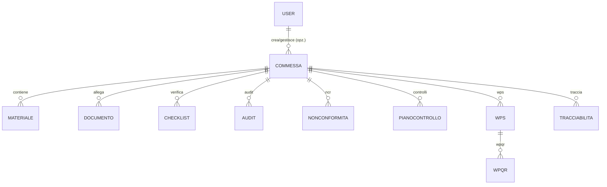

# EN1090 — Database Schema (Prisma/PostgreSQL)

Versione: 1.0  
Data: 2026-04-01  

## Obiettivo

Lo schema dati supporta i workflow tipici EN1090: gestione commesse, materiali e documentazione, checklist di controllo, audit, non conformità, WPS/WPQR e tracciabilità.

## Modelli principali (overview)

> Nota: la fonte di verità è `backend/prisma/schema.prisma`.

Entità core:

- **User**
- **Commessa**
- **Materiale**
- **Documento**
- **Checklist**
- **Audit**
- **NonConformita**
- **PianoControllo**
- **Wps**
- **Wpqr**
- **Tracciabilita**
- **Attrezzatura**

## Relazioni (alto livello)

## Convenzioni

- ID numerici auto-incrementali per la maggior parte dei modelli (eccetto `User.id`)
- Enum per stati/esiti (es. checklist, documenti, audit, NC)
- Campi `Json` per strutture dinamiche (es. elementi checklist, allegati)

## Note per auditor/certificatori

Punti osservabili:

- Tracciabilità delle evidenze tramite documenti e checklist
- Gestione NC: tipo/gravità/stato, causa e azione
- Audit con esito e note

