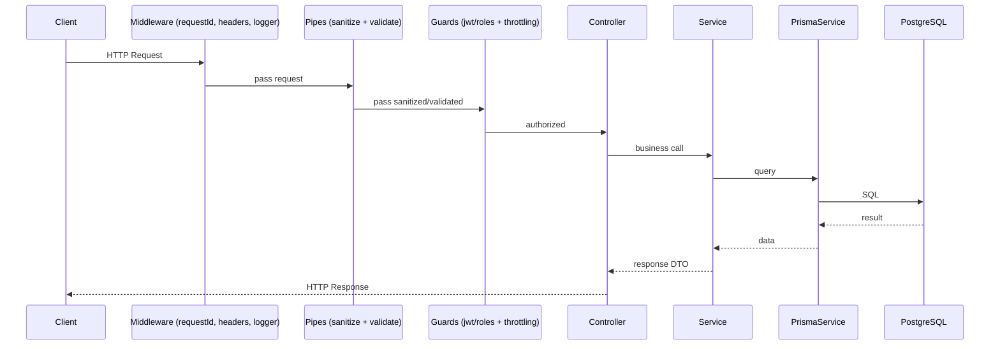

# EN1090 — Modules

Versione: 1.0  
Data: 2026-04-01  

## Backend (NestJS)

Struttura per moduli (indicativa):

- `auth`: login, refresh, logout, guard e strategy JWT
- `users`: CRUD utenti e ruoli
- `commesse`: gestione commesse
- `materiali`: gestione materiali
- `documenti`: upload e gestione documenti
- `checklist`: checklist controlli
- `audit`: audit e verifiche
- `non-conformita`: NCR/NC
- `wps`: WPS
- `wpqr`: WPQR
- `tracciabilita`: tracciabilità
- `report`: reportistica
- `health`: health endpoint
- `common`: filtri, interceptor, middleware, pipe comuni
- `prisma`: prisma module/service

## Flusso request (backend)

## Frontend (Next.js)

Cartella `safe-frontend/` con struttura Next.js (App Router).

