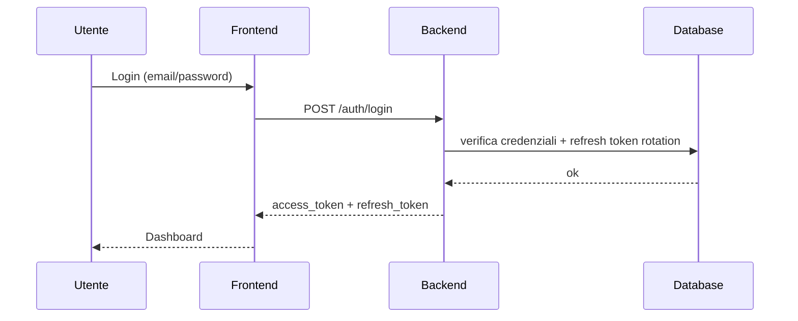

# EN1090 — Presentazione Progetto

Versione: 1.0  
Data: 2026-04-01  

## Problema

Le organizzazioni che producono componenti strutturali in acciaio/alluminio devono:

- Gestire commesse e documentazione in modo tracciabile
- Dimostrare controlli, audit e gestione NC
- Preparare evidenze per auditor e certificatori

Spesso i dati sono frammentati tra fogli, cartelle e strumenti non integrati.

## Soluzione

EN1090 fornisce una piattaforma web per:

- Gestione commesse, materiali e documenti
- Checklist operative con esiti e allegati
- Audit e non conformità (NCR) con stati e responsabilità
- Tracciabilità e reportistica
- API documentate via Swagger/OpenAPI

## Architettura (overview)

```mermaid
flowchart LR
  U[Utente / Browser] --> FE[Frontend (Next.js)]
  FE -->|HTTPS / REST| BE[Backend (NestJS)]
  BE -->|Prisma| DB[(PostgreSQL)]
  BE --> FS[(Storage file / volume)]
  BE --> DOCS[Swagger /docs]
```

## Moduli

- **Auth/Users**: accesso, ruoli, gestione utenti
- **Commesse**: entità principale operativa
- **Materiali**: gestione materiali e certificazioni
- **Documenti**: upload e stato approvazione
- **Checklist**: controlli per fase con esito e allegati
- **Audit**: esiti e note
- **Non Conformità**: tipo, gravità, stato, azioni
- **WPS/WPQR**: procedure e qualifiche
- **Tracciabilità**: collegamenti e riferimenti
- **Report**: estrazioni e reportistica (PDF/HTML dove previsto)

## Sicurezza

Misure principali:

- Header di sicurezza (Helmet) + CSP
- Rate limiting globale
- Sanitizzazione input
- Logging strutturato JSON con requestId
- Hardening JWT (payload validation)
- Audit log (login/logout e write operations)

## Flussi (alto livello)



## Roadmap (esempio)

- Dashboard KPI e scadenze (commesse/checklist/audit)
- Gestione allegati avanzata (versioning/approvazioni)
- Esportazione pacchetto evidenze per auditor
- Integrazione firma digitale (opzionale)

