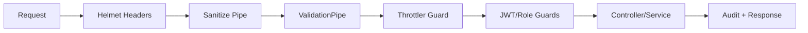

# EN1090 — Security

Versione: 1.0  
Data: 2026-04-01  

## Obiettivi

- Proteggere l’API da abusi comuni (header hardening, rate limit)
- Ridurre superfici di attacco (sanitizzazione input)
- Migliorare auditabilità e tracciabilità (requestId, audit log)
- Mantenere compatibilità e non introdurre breaking changes lato business

## Controlli implementati (backend)

### Header di sicurezza (Helmet)

- CSP (strict per API, disabilitata su `/docs` per Swagger UI)
- Frameguard (deny)
- HSTS
- NoSniff
- XSS Filter

### Rate limiting

- 100 richieste / 15 minuti / IP
- Esclusione endpoint `/health`

### Sanitizzazione input

- Sanitizzazione globale su body/query/params:
  - trim stringhe
  - rimozione null bytes
  - rimozione `` (best effort)
  - normalizzazione Unicode (NFKC)

### Logging strutturato

Log HTTP in JSON con:

- `timestamp`, `level`
- `requestId`
- `method`, `url`, `statusCode`, `durationMs`

### JWT hardening

- Validazione payload (sub/email/role) in strategy JWT e refresh
- Refresh token obbligatorio sulla refresh strategy

### Audit log

- Auth: `register`, `login`, `refresh`, `logout`
- Operazioni write: POST/PUT/PATCH/DELETE su risorse (esclude `/auth`)

## Diagramma (security flow)

## Raccomandazioni produzione

- Terminare TLS su reverse proxy/LB
- Segreti in secret manager/CI secrets
- Log centralizzati (ELK/Datadog/Grafana Loki)
- Backup e retention DB
- Rotazione periodica dei segreti JWT

